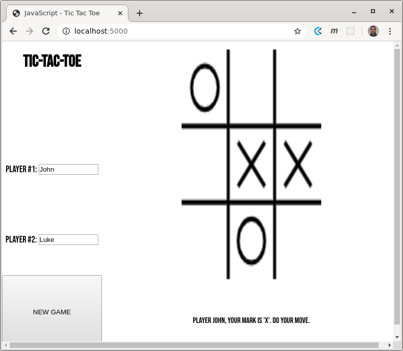

# TIC-TAC-TOE



## ABOUT THIS REPOSITORY

This repository stores a practice of JavaScript which consists of creating the simple game of [Tic-Tac-Toe](https://en.wikipedia.org/wiki/Tic-tac-toe). Players take turns, marking symbols on the grid. The player that makes a line made of the symbol of the player wins.

## GETTING STARTED

In order to see a live version of this project, cloning it and starting a [Node.js](https://nodejs.org/en/) server is required. This README.md assumes that you have the newest Node.js installed on your machine. If you do, the following commands may help you setting up this project.

```
git clone https://github.com/lhscar56/tic-tac-toe
cd tic-tac-toe
node simple-server.js
```

If all of these commands run successfully, open the address <a href="http://localhost:5000">http://localhost:5000</a> on your web browser, to see the application running.

## STACK
- Node.js
- Javascript
- HTML5/CSS3
- Jest


## AUTHORS

[Frederico Miranda](https://github.com/frederico-miranda)

[Gastón Costa](https://github.com/lhscar56)


🤝 Contributing
Contributions, issues and feature requests are welcome!

Feel free to check the issues page.

Show your support
Give a ⭐️ if you like this project!
